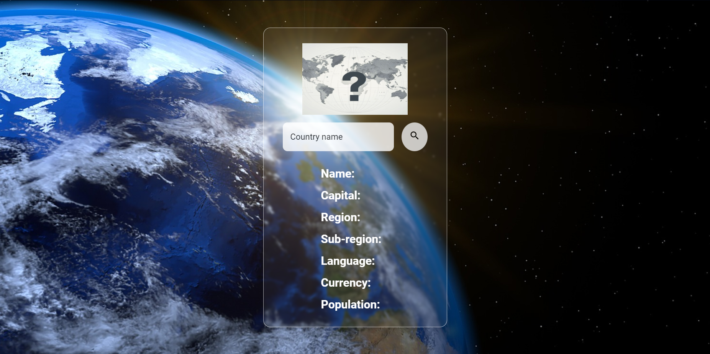
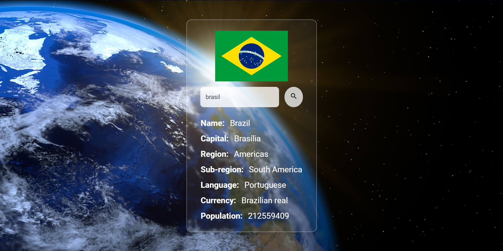

# CountriesTS &#127758;

With this project it's possible to search for informations about any country.  
I used the [Country Info API](<https://countryinfoapi.com/>) to get the data.

## Techs &#128187;
- TypeScript  
- React  
- Vite  
- react-icons  
- styled-components  

